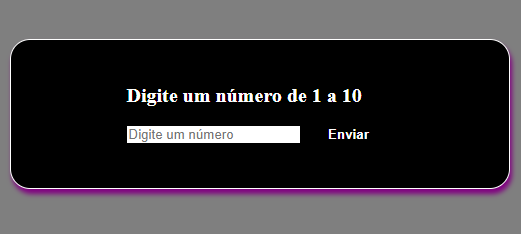
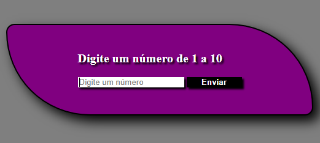
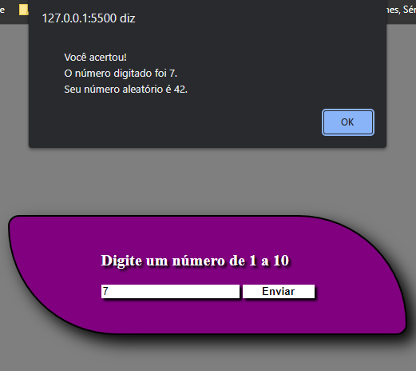

# Número Aleatório

## Sobre o projeto.
Site desenvolvido para devolver um número aleatório. 
Você digita um valor entre 1 e 10 e ele soma com um número aleatório.
Caso seja um valor diferente ele retorna uma mensagem de erro.

Data de conclusão: 21/12/2021

## Ferramentas e tecnologias usadas nesse projeto.
 
```js
function NumeroAleatorio(Project) {
    if (Front End) {
        const Stack = `${HTML}, ${CSS}, ${JavaScript}`;
    }
};
```
<br>

<div align="center">





</div>

---

> - Autores: 
>   - [Eduardo Kayke](https://github.com/EduardoKayke "Perfil do Eduardo")

- [Voltar ao perfil do Github.](https://github.com/EduardoKayke "Perfil do Eduardo")

_Um dia seremos a tecnologia. Biohacking a própria evolução de nós mesmos._
